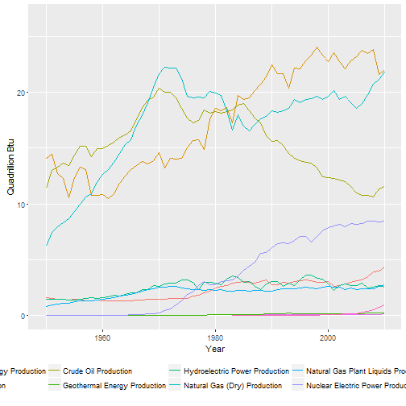

## Background and Data

* [The U.S. Energy Information Administration (EIA)](http://www.eia.gov/about/) collects, analyzes, and disseminates independent and impartial energy information to promote sound policymaking, efficient markets, and public understanding of energy and its interaction with the economy and the environment.  
* EIA publishes data on energy that comes from a variety of sources, including petroleum, coal, natural gas, nuclear and renewable sources. It also collects data on energy production, consumption, efficiency, and market. 
* Data used for this web application are from [EIA total energy annual data](https://www.eia.gov/totalenergy/data/annual/index.cfm). Under subsection Energy Overview, data tables 1.1 - 1.4 were downloaded. 

--- 

## Web Application Overview

#### The ui.R asks for two inputs from the user:  
1. a category of data of choice (select input)  
2. a range of years of interest (slider input)  

#### The server.R realizes the following objectives:  
1. read raw data  
2. process raw data into clean and relevant data for app use  
3. create a energy vs. time line plot based on user input 

---

## Application Example  


Every time a user opens the web application, the server.R first reads the raw data.  

```r
## Read raw data (need to change to the directory that contains both data and scripts)
overview <- read.csv("C:/Users/linwa_000/DDP_Course_Project/MER_T01_01.csv")
production <- read.csv("C:/Users/linwa_000/DDP_Course_Project/MER_T01_02.csv", na.strings = "Not Available")
consumption <- read.csv("C:/Users/linwa_000/DDP_Course_Project/MER_T01_03.csv", na.strings = "Not Available")
import <- read.csv("C:/Users/linwa_000/DDP_Course_Project/MER_T01_04A.csv", na.strings = "Not Available")
export <- read.csv("C:/Users/linwa_000/DDP_Course_Project/MER_T01_04B.csv", na.strings = "Not Available")
```
Then a series of processing and transformation are performed to obtain clean data for plotting (code not shown).  


---

## Application Example 

When a user is interested in "energy production by source" from 1950 to 2010, switch() function transforms the input into the right data set, and the plot is generated by ggplot:   



